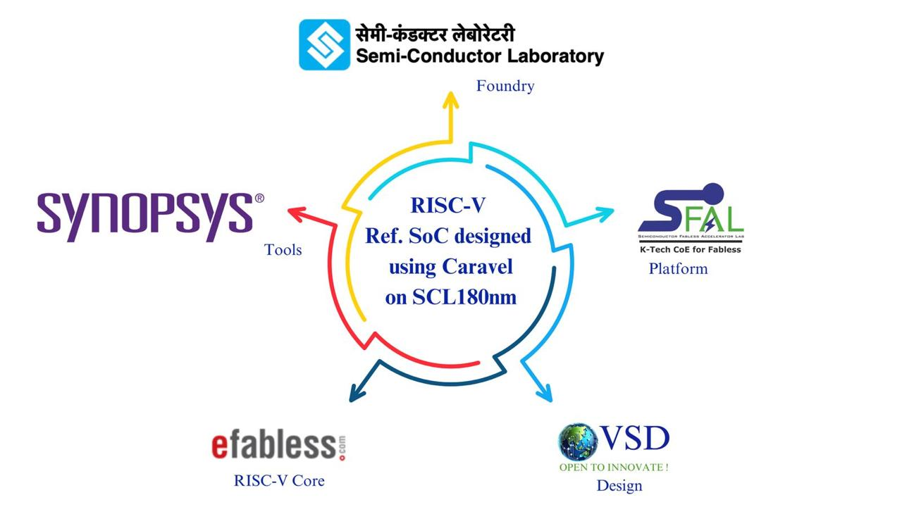
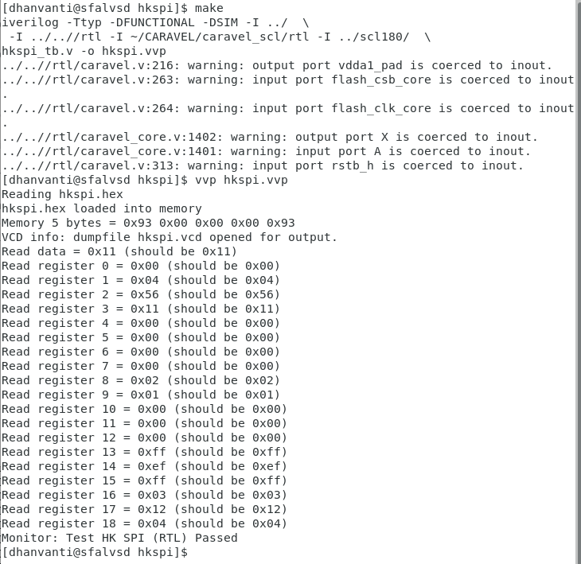
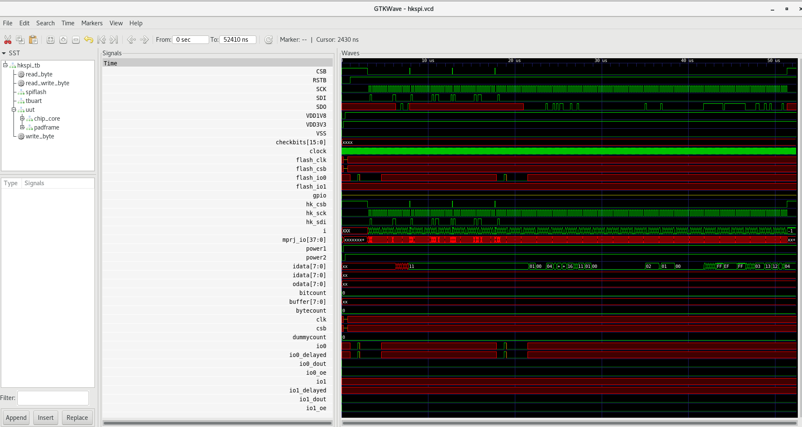
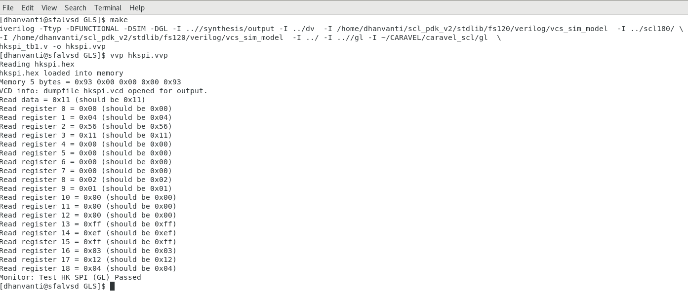
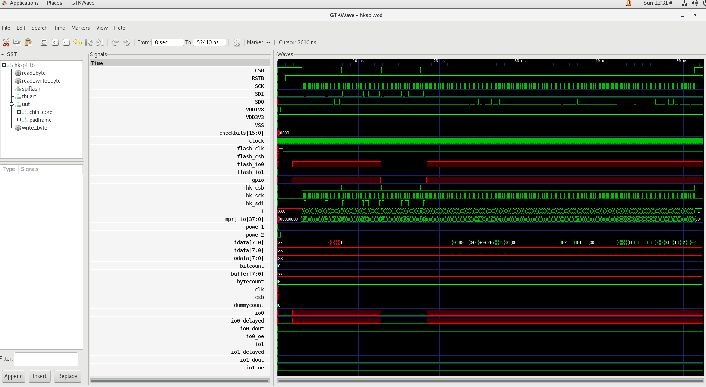

# RISC-V Reference SoC Implementation using Synopsys and SCL180 PDK

## Overview
This repository contains a reference RISC-V SoC implementation with I/O interfaces from SCL (Semiconductor Laboratory), designed specifically for participants under the SMDP (Special Manpower Development Program). The RISC-V SoC implementation IP provided here serves as a reference design and is absolutely FREE to use for tapeout purposes with the SCL180 process. Access to this repository is restricted to individuals who have access to Synopsys tools and have signed a Non-Disclosure Agreement (NDA) with Semiconductor Laboratory (SCL) to use their 180nm Process Design Kits (PDKs).



- Project by :- Dhanvanti Bhavsar
- Mentored by :- Mr. Kunal Ghosh (VLSI System Design) and SFAL 
- PDK used :- SCL180
- Tool used :- Synopsys Design Tools
- Top Module :- vsdcaravel

  **caravel** is from efabless+SKY130+opensource , while **vsdcaravel** is from vsd+SCL180+Synopsys

## Features
- **Synthesis and Gate-Level Simulation (GLS)** of VSDCaravel SoC, derived from original Caravel by efabless
- **Utilization of SCL180 PDK** for ASIC design
- **Reproducible and Open-source Workflow**

## Repository Structure
```
VsdRiscvScl180/
├── dv             # Contains functional verification files 
├── gl             # Contains GLS supports files
├── gls            # Contains test bench files and synthesized netlists
├── rtl            # Contains verilog files        
├── synthesis      # Contains synthesis scripts and outputs
   ├──output       # Contain synthesis output
   ├──report       # Contain area,power and qor post synth report
   ├──work         # Synthesis work folder
├── README.md      # This README file
```


## Prerequisites
Before using this repository, ensure you have the following dependencies installed:

- **SCL180 PDK** ( SCL180 PDK)
- **RiscV32-uknown-elf.gcc** (building functional simulation files)
- **Caravel User Project Framework** from Efabless
- **Synopsys EDA tool Suite** for Synthesis
- **Verilog Simulator** (e.g., Icarus Verilog)
- **GTKWAVE** (used for visualizing testbench waves)

## Test Instructions
### Repo Setup
1. Clone the repository:
   ```sh 
   git clone https://github.com/vsdip/vsdRiscvScl180.git
   cd vsdRiscvScl180
   ```
2. Install required dependencies (ensure dc_shell and SCL180 PDK are properly set up).

### Functional Simulation Setup
3. Setup functional simulation file paths
   - Edit Makefile at this path [./dv/hkspi/Makefile](./dv/hkspi/Makefile)
   - Modify and verify `GCC_Path` to point to correct riscv installation
   - Modify and verify `scl_io_PATH` to point to correct io

###  Functional Simulation Execution
4. open a terminal and cd to the location of Makefile i.e. [./dv/hkspi](./dv/hkspi)
5. make sure hkspi.vvp file has been deleted from the hkspi folder
6. Run following command to generate vvp file for functional simulation
   ```
   make
   vvp hkspi.vvp
   ```
- you should receive output similar to following output on successfull execution

7. Visualize the Testbench waveforms for complete design using following command
   ```
   gtkwave hkspi.vcd hkspi_tb.v
   ```
   

### Synthesis Setup
8. Modify and verify following variables in synth.tcl file at path [./synthesis/synth.tcl](./synthesis/synth.tcl)
   ```
   library Path
   Root Directory Path
   SCL PDK Path
   SCL IO PATH

   ```
### Running Synthesis
9. open a terminal and cd to the work folder i.e. [./synthesis/work_folder](./synthesis/work_folder)
10. Run synthesis using following command
```
dc_shell -f ../synth.tcl
```
This should update the caravel_snthesis.v file in [./synthesis/output](./synthesis/output) folder
### GLS Setup
11. Modify and verify following variables in Makefile at path [./gls/Makefile](./gls/Makefile) according to your paths
```
SCL PDK Path
GCC Path
SCL IO Path
```

12. Modify synthesized netlist at path [./synthesis/output/vsdcaravel_synthsis.v](./synthesis/output/caravel_synthesis.v) to remove blackboxed modules
   - Remove following modules
   ```
   dummy_por
   RAM128
   housekeeping
   ```
   - add following lines at the beginning of the netlist file to import the blackboxed modules from functional rtl
   ```
   `include "dummy_por.v"
   `include "RAM128.v
   `include "housekeeping.v"
   ```
###  GLS Execution
13. open a terminal and cd to the location of Makefile i.e. [./gls](./gls)
14. Replace 1'b0 from vsdcaravel.v file with vssa.
15. make sure hkspi.vvp file has been deleted from the GLS folder
16. Run following command to generate vvp file for GLS
   ```
   make
   vvp hkspi.vvp
   ```
- you should receive output similar to following output on successfull execution

17. Visualize the Testbench waveforms for complete design using following command
   ```
   gtkwave hkspi.vcd hkspi_tb.v
   ```
   
18. Compare output from functional Simulation and GLS to verify the synthesis output

    
## Results
- Successfully ran functional simulations, synthesis and GLS for VexRiscV Harnessed with Efabless's Caravel usign SCL180 PDK.

## Reports
### Area Post Synth Report
```
Library(s) Used:

    tsl18fs120_scl_ff (File: /home/dhanvanti/scl_pdk_v2/stdlib/fs120/liberty/lib_flow_ff/tsl18fs120_scl_ff.db)
    tsl18cio250_typ (File: /home/dhanvanti/scl_pdk_v2/iolib/cio250/synopsys/2002.05/models/tsl18cio250_typ.db)

Number of ports:                        14629
Number of nets:                         40000
Number of cells:                        32118
Number of combinational cells:          19409
Number of sequential cells:              6922
Number of macros/black boxes:              20
Number of buf/inv:                       3806
Number of references:                       2

Combinational area:             357559.430147
Buf/Inv area:                    33122.289901
Noncombinational area:          484149.441730
Macro/Black Box area:             5282.080254
Net Interconnect area:           36202.034977

Total cell area:                846990.952131
Total area:                     883192.987108
1
```
### Power Post Synth Report
```
Library(s) Used:

    tsl18fs120_scl_ff (File: /home/dhanvanti/scl_pdk_v2/stdlib/fs120/liberty/lib_flow_ff/tsl18fs120_scl_ff.db)
    tsl18cio250_typ (File: /home/dhanvanti/scl_pdk_v2/iolib/cio250/synopsys/2002.05/models/tsl18cio250_typ.db)


Operating Conditions: tsl18fs120_scl_ff   Library: tsl18fs120_scl_ff
Wire Load Model Mode: top

Design        Wire Load Model            Library
------------------------------------------------
vsdcaravel             1000000           tsl18fs120_scl_ff


Global Operating Voltage = 1.98 
Power-specific unit information :
    Voltage Units = 1V
    Capacitance Units = 1.000000pf
    Time Units = 1ns
    Dynamic Power Units = 1mW    (derived from V,C,T units)
    Leakage Power Units = 1pW


Attributes
----------
i - Including register clock pin internal power


  Cell Internal Power  =  39.2572 mW   (54%)
  Net Switching Power  =  33.4425 mW   (46%)
                         ---------
Total Dynamic Power    =  72.6997 mW  (100%)

Cell Leakage Power     =   1.5620 uW

Information: report_power power group summary does not include estimated clock tree power. (PWR-789)

                 Internal         Switching           Leakage            Total
Power Group      Power            Power               Power              Power   (   %    )  Attrs
--------------------------------------------------------------------------------------------------
io_pad             3.2232        7.3891e-03        4.1871e+05            3.2310  (   4.44%)
memory             0.0000            0.0000            0.0000            0.0000  (   0.00%)
black_box          0.0000            0.2323           62.7200            0.2323  (   0.32%)
clock_network      0.0000            0.0000            0.0000            0.0000  (   0.00%)  i
register           0.0000            0.0000            0.0000            0.0000  (   0.00%)
sequential        33.9336        8.8387e-02        7.1949e+05           34.0228  (  46.80%)
combinational      2.1015           33.1122        4.2372e+05           35.2138  (  48.44%)
--------------------------------------------------------------------------------------------------
Total             39.2582 mW        33.4402 mW     1.5620e+06 pW        72.6999 mW
1

```
### QoR Post Synth Report
```
Timing Path Group (none)
  -----------------------------------
  Levels of Logic:              59.00
  Critical Path Length:          8.76
  Critical Path Slack:         uninit
  Critical Path Clk Period:       n/a
  Total Negative Slack:          0.00
  No. of Violating Paths:        0.00
  Worst Hold Violation:          0.00
  Total Hold Violation:          0.00
  No. of Hold Violations:        0.00
  -----------------------------------


  Cell Count
  -----------------------------------
  Hierarchical Cell Count:       1496
  Hierarchical Port Count:      14566
  Leaf Cell Count:              26351
  Buf/Inv Cell Count:            3806
  Buf Cell Count:                 543
  Inv Cell Count:                3266
  CT Buf/Inv Cell Count:            0
  Combinational Cell Count:     19527
  Sequential Cell Count:         6824
  Macro Count:                      0
  -----------------------------------


  Area
  -----------------------------------
  Combinational Area:   357559.430147
  Noncombinational Area:
                        484149.441730
  Buf/Inv Area:          33122.289901
  Total Buffer Area:          8173.68
  Total Inverter Area:       25146.19
  Macro/Black Box Area:   5282.080254
  Net Area:              36202.034977
  -----------------------------------
  Cell Area:            846990.952131
  Design Area:          883192.987108


  Design Rules
  -----------------------------------
  Total Number of Nets:         31195
  Nets With Violations:             0
  Max Trans Violations:             0
  Max Cap Violations:               0
  -----------------------------------


  Hostname: sfalvsd

  Compile CPU Statistics
  -----------------------------------------
  Resource Sharing:                   73.81
  Logic Optimization:                 68.76
  Mapping Optimization:               50.73
  -----------------------------------------
  Overall Compile Time:              213.69
  Overall Compile Wall Clock Time:   215.23

  --------------------------------------------------------------------

  Design  WNS: 0.00  TNS: 0.00  Number of Violating Paths: 0


  Design (Hold)  WNS: 0.00  TNS: 0.00  Number of Violating Paths: 0

  --------------------------------------------------------------------

```
## Issues
- Housekeeping module has not synthesized successfully and was blackboxed for GLS purpose. 
- POR, RAM modules are blackboxed and will be replaced with SCL POR and memories in future

## Future Roadmap
- Resolve houskeeping issues
- Generate more testbench simulations based on vsdcaravel internal function
- Include SCL POR and RAM
- Complete ICC2 flow for tapeout

## Refrences
- https://github.com/efabless/caravel/


